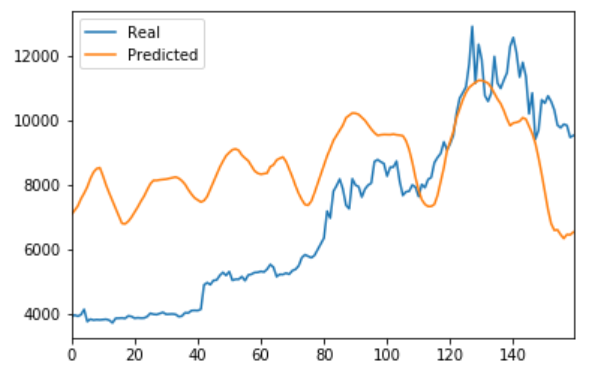
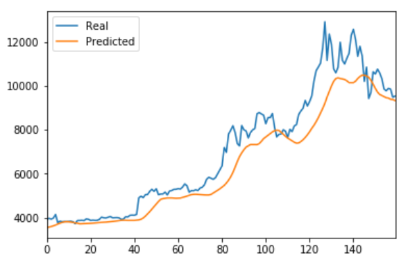

# Unit14_DeepLearning
## LSTM Stock Predictor

- In this module I used two different factors: the Crypto Fear and Greed Index (FNG) indicator; and a window of bitcoin closing prices to predict the future closing pric. In both models, I used deep learning recurrent neural networks (RNN) to model bitcoin closing prices. 

   1. - For the FNG model, datas came from a csv file which includes historical FNG values. 70% of the data were used for training and 30% for testing. A MinMaxScaler matric was used to scale the X and y values for the model. 
      - A window_data function was created to help window the data. And a window size of 10 was used since it worked the best for the model. 
      - When training the LSTM RNN model, 40 epochs and a batch size of 10 were used; because after experimenting different epochs and batch size, these two have delivered the lowest loss. 
      - After performing model evaluation, this model has a loss of 0.0822.
      - However, this model doesn't seem to be working very well as we can see in the following graph: 
      
      - The predicted values seems to be an average of the actual prices; it didn't accuratly predict the volatility of the bitcoin price. 
      --------

    2. - The second model was using bitcoin closing price as input data. Same train and test split was applied. 
       - In order to compare two models accurately, the same parameters and training steps were applied on this model. 
       - After performing model evaluation, it has a lower loss of 0.0102
       - As we can see in the following graph:
       
         The predicted value is much more accurate than the previous model predicted value. 
